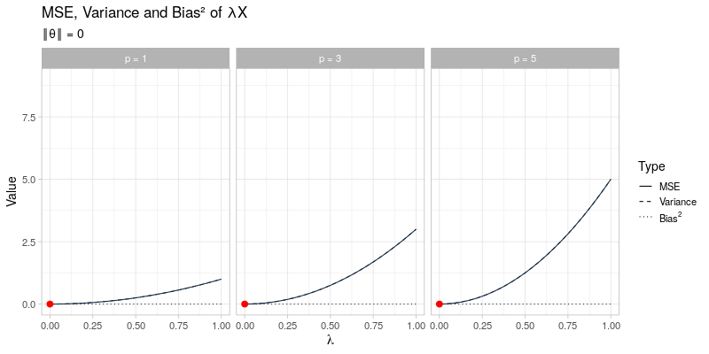

```{r setup, include=FALSE}
knitr::opts_chunk$set(collapse = TRUE, warning = FALSE, message = FALSE, gganimate = list(nframes = 50),
                      fig.align = "center", comment = "#>", out.width = "100%")
```

# Stein's paradox

[Stein's example](https://en.wikipedia.org/wiki/Stein%27s_example), perhaps better known under the name *Stein's Paradox*, is a well-known example in statistics that demonstrates the use of **shrinkage** to reduce the mean squared error ($L_2$-risk) of a multivariate estimator with respect to classical (unbiased) estimators, such as the maximum likelihood estimator. It is named after [Charles Stein](https://en.wikipedia.org/wiki/Charles_M._Stein) who originally introduced this phenomenon in [@S56], and it is seen as an important contribution to the field of statistics, with grand mentions of Stein's paradox online, such as: 

>  In the words of one of my professors, "Stein's Paradox may very well be the most significant result in Mathematical Statistics since World War II."[^1]

This seems like a fairly bold claim, but it is nonetheless an enlightening example as its setup is easy to grasp and the result is quite counter-intuitive at first sight. In its simplest form, Stein's example can be stated as follows:

Let $X_1, \ldots, X_p$ be independent random variables, such that $X_i \sim N(\theta_i, 1)$ for each $i = 1, \ldots, p$. Now, our goal is to estimate the unknown parameters $\theta_1, \ldots, \theta_p$. Since we have only one noisy measurement of each $\theta_i$, an obvious choice of estimator is $\hat{\theta}_i = X_i$ for each $i$. So far nothing special, but now the interesting part follows...

If the quality of the estimator is measured by its mean squared error:

$$
\mathbb{E}\left[ \Vert \hat{\boldsymbol{\theta}} - \boldsymbol{\theta} \Vert^2 \right] \ = \ \sum_{i = 1}^p \mathbb{E}\left[ (\hat{\theta}_i - \theta_i)^2 \right],
$$
then it turns out that this obvious estimator is *inadmissible* (i.e. suboptimal) whenever $p \geq 3$ in the sense that we can find a different estimator that **always** achieves a lower mean squared error, no matter what the value of $\boldsymbol{\theta}$ is. 

Moreover, such an estimator does not only exist in theory, [@JS61] derive the following explicit form of an estimator that strictly dominates $\hat{\boldsymbol{\theta}}$ in terms of the mean squared error[^2]:

$$
\hat{\boldsymbol{\theta}}_{JS} = \left( 1 - \frac{p - 2}{\Vert \boldsymbol{X} \Vert^2}\right) \boldsymbol{X}
$$

Taking a closer look at the James-Stein estimator, it is seen that it **shrinks** the initial estimator ($\boldsymbol{X}$) towards the origin[^3] by multiplication with a certain shrinkage factor that is proportional to the norm of $\boldsymbol{X}$ and the dimension $p$. This certainly seems surprising and for Stein's audience perhaps even paradoxical: given a set of individual noisy observations with means $\theta_1, \ldots, \theta_p$, instead of taking the individual observations as estimators of $\theta_1, \ldots, \theta_p$, we can apparently obtain a *better* estimator by moving the observations towards some arbitrary point in the space, in this case the origin. How to make sense of this?

# Bias-Variance tradeoff

The key insight to make this phenomenon intuitive is to understand that we asses the quality of the estimator by the **combined** mean squared errors of all $\theta_i$'s, i.e. $\sum_{i = 1}^p \mathbb{E}[(\hat{\theta_i} - \theta_i)^2]$. If we were to assess the quality of the estimator based only on the mean squared error of a single $\theta_i$, no shrinkage estimator will in fact be able to uniformly dominate $\hat{\theta}_i = X_i$. However, since we focus on the mean squared error across all $\theta_i$'s, it turns out we can do slightly better by reducing the variance of the estimator at the cost of adding some bias. I feel that in some of the online sources I came across before writing this post, this point is not nearly stressed enough (or not even mentioned at all). Especially in the context of modern statistics and machine learning, where **bias-variance** trade-offs play a key role (an aspect in which Stein may have played a part himself), I believe that Stein's paradox is an excellent demonstration of how giving up unbiasedness allows one to achieve *better* estimators in terms of mean squared error.

Before we make some plots to visualize the previous insights, recall that we can always decompose the mean squared error into (1) a squared bias term and (2) a variance term, the derivation of which only relies on the linearity of the expectation:

$$
\sum_{i = 1}^p \mathbb{E}\left[(\hat{\theta}_i - \theta_i)^2 \right] \ = \ \sum_{i = 1}^p \left(\mathbb{E}[\hat{\theta}_i] - \theta_i \right)^2 + \sum_{i = 1}^p \mathbb{E}\left[(\hat{\theta_i} - \mathbb{E}[\hat{\theta_i}])^2\right]
$$
The estimator $\hat{\boldsymbol{\theta}} = \boldsymbol{X}$ satisfies $\mathbb{E}[\hat{\boldsymbol{\theta}}] = \boldsymbol{\theta}$ so the first term drops out, and the second term is equal to $p$ due to our assumption that $\text{var}(X_i) = 1$ for each $i$. So far so good, now let's define a general shrinkage estimator of the form $\hat{\boldsymbol{\theta}}_{\lambda} = \lambda \boldsymbol{X}$. It is straightforward to write out the squared bias and variance terms explicitly for any given $\lambda \in \mathbb{R}$: 

$$
\sum_{i = 1}^p \mathbb{E}\left[(\hat{\theta}_{\lambda, i} - \theta_i)^2 \right] \ = \ \underbrace{(\lambda - 1)^2 \Vert \boldsymbol{\theta} \Vert^2}_{\text{Bias}^2} + \underbrace{\lambda^2 \cdot p}_{\text{Variance}}
$$

Taking a closer look at the right-hand side, we see that for any given $\lambda$, the variance term only depends on the dimension $p$, and the bias term only depends on the norm (i.e. size) of $\boldsymbol{\theta}$. At one end of the spectrum, if $\lambda = 1$, we retrieve our original estimator $\hat{\boldsymbol{\theta}}_1 = \boldsymbol{X}$, which has zero bias and maximal variance. At the other end of the spectrum, if $\lambda = 0$, the estimator reduces to a constant $\hat{\boldsymbol{\theta}}_0 = \boldsymbol{0}$, which has zero variance but an arbitrarily large bias. 

The mean squared error of the general shrinkage estimator $\hat{\boldsymbol{\theta}} = \lambda \boldsymbol{X}$ across a range of different values for $\lambda$ is visualized in the animated plot below. From left to right the dimension $p$ is varied between $p = 1, 3, 5$, which only affects the variance term of $\hat{\boldsymbol{\theta}}_{\lambda}$ and not its bias. In contrast, going through the animation $\Vert \boldsymbol{\theta} \Vert$ ranges from 0 to 3, which only has an impact on the bias of $\hat{\boldsymbol{\theta}}_\lambda$, whereas the variance term remains unaffected. As the size of $\boldsymbol{\theta}$ and the dimension $p$ vary, the optimal amounts of shrinkage $\lambda^*$ that minimize the mean squared error (indicated by the red dots) evolve by moving towards $\lambda = 1$ as $\Vert \boldsymbol{\theta} \Vert \to \infty$ at different speeds for different values of $p$:


This visualization effectively illustrates why shrinkage becomes more effective (i.e. choosing a smaller value for $\lambda$) as the dimension $p$ becomes larger by reducing the variance at the cost of adding some additional bias. Recall that the James-Stein estimator only strictly dominates the unbiased estimator $\hat{\boldsymbol{\theta}} = \boldsymbol{X}$ for $p \geq 3$.

On the other hand, the visualization also demonstrates that for larger values of $\Vert \boldsymbol{\theta} \Vert$, the applied amount of shrinkage should become smaller (i.e. using a larger value for $\lambda$), thereby opting for a small bias term at the cost of a larger variance. Essentially, this is exactly what the James-Stein estimator tries to do: 

$$
\hat{\boldsymbol{\theta}}_{JS} = \left( 1 - \frac{p - 2}{\Vert \boldsymbol{X} \Vert^2}\right) \boldsymbol{X}
$$
For larger values of $p$, $\lambda = 1 - \frac{p - 2}{\Vert \boldsymbol{X} \Vert^2}$ decreases (potentially even becoming negative, which is actually not what we want and suggests why the positive-part James-Stein estimator might still lead to an improvement). For larger values of $\Vert \boldsymbol{\theta} \Vert$, the shrinkage factor $\lambda$ should move towards 1. The actual value of $\Vert \boldsymbol{\theta} \Vert$ is unknown given only $\boldsymbol{X}$, but since $\boldsymbol{X}$ itself is centered around $\boldsymbol{\theta}$, the term $\frac{1}{\Vert \boldsymbol{X} \Vert^2}$ in the shrinkage factor can be understood to serve as a proxy[^4] for $\frac{1}{\Vert \boldsymbol{\theta} \Vert^2}$. This way, the shrinkage factor $\lambda$ will be approximately equal to 1 for large values of $\Vert \boldsymbol{X} \Vert$.

Finally, it also becomes intuitive why the choice of the shrinkage target does not actually matter and can be set to any $\boldsymbol{\theta}_0 \in \mathbb{R}^p$ instead of the origin. The mean squared error of the generalized shrinkage estimator $\hat{\boldsymbol{\theta}}_{\theta_0, \lambda} = \boldsymbol{\theta}_0 + \lambda (\boldsymbol{X} - \boldsymbol{\theta}_0)$ is simply:

$$
\sum_{i = 1}^p \mathbb{E}\left[(\hat{\theta}_{\theta_0, \lambda, i} - \theta_i)^2 \right] \ = \ (\lambda - 1)^2 \Vert \boldsymbol{\theta} - \boldsymbol{\theta}_0 \Vert^2 + \lambda^2 \cdot p
$$
And exactly the same bias-variance tradeoffs as before apply. In particular, the James-Stein estimator with a non-trivial shrinkage target $\boldsymbol{\theta}_0$ becomes:

$$
\hat{\boldsymbol{\theta}}_{JS, \theta_0} = \boldsymbol{\theta}_0 + \left( 1 - \frac{p - 2}{\Vert \boldsymbol{X} - \boldsymbol{\theta}_0 \Vert^2}\right) (\boldsymbol{X} - \boldsymbol{\theta}_0)
$$

# References

[^1]: https://www.naftaliharris.com/blog/steinviz/.
[^2]: it turns out the James-Stein estimator itself is also inadmissable, as it is dominated by the positive-part James-Stein estimator $\hat{\boldsymbol{\theta}}_{JS+} = \left( 1 - \frac{p - 2}{\Vert \boldsymbol{X} \Vert^2}\right)_+ \boldsymbol{X}$.
[^3]: there is nothing special about the origin in particular and we could shrink just as well towards an arbitrary vector $\boldsymbol{\theta}_0 \in \mathbb{R}^p$. 
[^4]: note that $\frac{1}{\Vert \boldsymbol{X} \Vert^2}$ is *not* an unbiased estimator of $\frac{1}{\Vert \boldsymbol{\theta}\Vert^2}$
