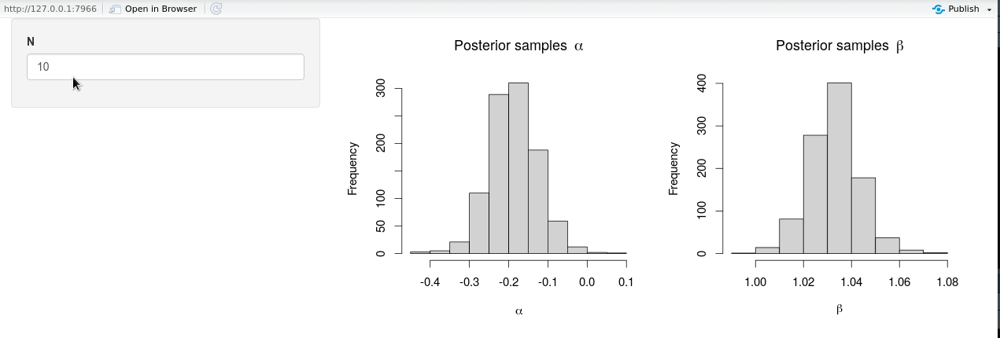

```{r setup, include=FALSE}
knitr::opts_chunk$set(collapse = TRUE, warning = FALSE, message = FALSE, eval = FALSE,
                      fig.align = "center", comment = "#>", out.width = "100%")
```

# Introduction

The aim of this post is to provide a short step-by-step guide on writing interactive [R Shiny](https://shiny.rstudio.com/)-applications that include models written in [Stan](https://mc-stan.org/) using [`rstan`](https://mc-stan.org/users/interfaces/rstan) and [`rstantools`](https://mc-stan.org/users/interfaces/rstantools). The remainder of this post assumes a small amount of working knowledge on writing models in Stan and usage of the package `rstan` to interface Stan from R.

## Demo set-up
For demonstration purposes, let's start by writing a minimal Stan model file `lm.stan`:

```{stan output.var="bernoulli"}
data {
int<lower=0> N;
vector[N] x;
vector[N] y;
}
parameters {
real alpha;
real beta;
real<lower=0> sigma;
}
model {
y ~ normal(alpha + beta * x, sigma);
}
```

This Stan file encodes a simple linear regression model of the form:

$$
y_i \ \overset{\text{iid}}{\sim} \ N(\alpha + \beta \cdot x_i, \sigma^2), \quad i = 1,\ldots,N
$$

Next, we create a small shiny-app contained in a single file `app.R` (in the same directory as `lm.stan`) that draws posterior samples from the Stan model in `lm.stan` with calls to `rstan::stan_model()` and `rstan::sampling()`: 

```{r}
library(shiny)
library(rstan)

ui <- fluidPage(
  sidebarLayout(
    sidebarPanel(
      numericInput("N", label = "N", value = 10)
    ),
    mainPanel(
      plotOutput("posteriors")
    )
  )
)

server <- function(input, output, session) {
  ## compile stan model
  model <- stan_model(file = "lm.stan")
  ## draw samples
  draws <- reactive({
    N <- input$N
    sampling(
      file = "lm.stan",
      data = list(N = N, x = seq_len(N), y = rnorm(N, seq_len(N), 0.1)),
      chains = 2,
      iter = 1000
    )
  })
  ## plot histograms
  output$posteriors <- renderPlot({
    req(draws())
    op <- par(mfrow = c(1, 2), cex = 1.25)
    hist(extract(draws(), "alpha")[[1]], main = bquote("Posterior samples"~alpha), xlab = expression(alpha))
    hist(extract(draws(), "beta")[[1]], main = bquote("Posterior samples"~beta), xlab = expression(beta))
    par(op)
  })
  
}

shinyApp(ui = ui, server = server)
```

The contents of this shiny-app can be summarized in a simple reactive graph:

```{r, eval = TRUE, echo = FALSE}
DiagrammeR::mermaid("
graph LR
   A{Update N} --> B[1. Generate new y<sub>1</sub>,...,y<sub>N</sub></br>2. Draw new posterior samples]
   B --> C[Plot posterior histograms]
  ", height = 150)
```

New noisy responses $y_1, \ldots, y_N$ are generated according to $y_i \overset{\text{iid}}{\sim} N(\alpha + \beta \cdot x_i, \sigma^2)$ with $x_i = i$ for each $i = 1,\ldots, N$ and fixed parameters $\alpha = 0$, $\beta = 1$ and $\sigma = 0.1$. 

## Slow model compilation

A fixed number of 2000 posterior samples for $\alpha$ and $\beta$ (and $\sigma$) is drawn across two individual chains (i.e. 1000 draws per chain), which should not take more than a few seconds to complete on an ordinary laptop computer, especially if $N$ is small. However, when launching the shiny-app, it becomes evident that it takes significantly longer to complete drawing any initial posterior samples. 

The reason for this is (obviously) that the Stan model has to be **recompiled** from the `lm.stan` file whenever we launch the shiny-app in a new R-session due to the call to `rstan::stan_model()`. Depending on the compiler settings, it takes up to ~1 minute to compile this single Stan model on my laptop computer, which more or less defeats the purpose of creating a shiny-app for interactive use. 

Luckily, it is quite simple to avoid this unnecessary computational effort: we just have to compile our Stan models beforehand so that we can sample directly from the already compiled Stan models and skip the compilation step in `rstan::stan_model()`. Before describing a general R-package approach using `rstantools`, we start with a simpler approach --suitable for a large set of standard regression models-- which is to take advantage of the pre-compiled Stan models in [`rstanarm`](https://mc-stan.org/rstanarm/). 

# Pre-compiled models with `rstanarm`

If the model we wish to sample from is already made available in R via the `rstanarm`-package, arguably the most straightforward approach to avoid unnecessary Stan model compilation is to use `rstanarm`'s R wrapper functions to directly sample from a pre-compiled Stan model. Note that if we are fitting a relative standard regression model, there is a decent chance a pre-compiled model version is available in `rstanarm`. Besides the fact that the Stan models in `rstanarm` are pre-compiled, the implementations of the Stan programs are likely more robust and computationally stable than any quick Stan program we would implement ourselves.

To sample from a simple linear model as defined in `lm.stan` with `rstanarm`, it suffices to remove the call to `rstan::stan_model()` in `app.R` and replace `rstan::sampling()` by a call to `rstanarm::stan_lm()` or `rstanarm::stan_glm()`[^1]:

```{r}
library(shiny)
library(rstanarm)

ui <- fluidPage(
  sidebarLayout(
    sidebarPanel(
      numericInput("N", label = "N", value = 10)
    ),
    mainPanel(
      plotOutput("posteriors")
    )
  )
)

server <- function(input, output, session) {
  ## draw samples directly
  draws <- reactive({
    N <- input$N
    samples <- stan_glm(
      formula = y ~ x,
      data = data.frame(x = seq_len(N), y = rnorm(N, seq_len(N), 0.1)),
      chains = 2,
      iter = 1000
    )
    as.matrix(samples)[, c(1, 2)]
  })
  ## plot histograms
  output$posteriors <- renderPlot({
    req(draws())
    op <- par(mfrow = c(1, 2), cex = 1.25)
    hist(draws()[, 1], main = bquote("Posterior samples"~alpha), xlab = expression(alpha))
    hist(draws()[, 2], main = bquote("Posterior samples"~beta), xlab = expression(beta))
    par(op)
  })
  
}

shinyApp(ui = ui, server = server)
```



The modified shiny-app no longer exhibits the same lack of responsiveness due to (unnecessary) Stan model recompilation, and it is seen from the animation that new posterior samples are generated almost instantly. 

**Remark**: note that the model used by `stan_glm()` is not exactly equivalent to the model in `lm.stan`, since `stan_glm()` assigns weakly informative priors to the model parameters by default[^2], whereas (non-informative) uniform priors are used in the original `lm.stan` file.

That's great, but what if the model we wish to fit is not available through the `rstanarm`-package? In this case, we can mimic the same general approach that `rstanarm` follows: compile the Stan models **once** on package installation, and directly sample from the pre-compiled models thereafter. As it turns out, we can make use of the excellent [`rstantools`](https://mc-stan.org/users/interfaces/rstantools)-package for exactly this purpose. The `rstantools`-package essentially eliminates the effort of setting up a correct R-package structure and only requires us to include the Stan programs that should be compiled with the R-package.

# Creating a package with `rstantools`

To set up a new R-package that should interface Stan, we call `rstantools::rstan_create_package()` which is roughly similar in use to `package.skeleton()`, (or `usethis::create_package()` or `Rcpp::Rcpp.package.skeleton()` for that matter). The already existing `lm.stan` file can be included immediately when initializing the package, any new Stan files can be added later to the `inst/stan` folder. If we do not mind having `rstantools` as a package dependency, it makes sense to set `auto_config = TRUE` (the default), which avoids the need to manually reconfigure the package with `rstantools::rstan_config()` whenever a `.stan` file is `inst/stan` are added, removed or modified.

```{r}
## initialize R-package 
rstantools::rstan_create_package(
  path = "shinyStanModels",
  stan_files = "lm.stan"
)
```
After updating the DESCRIPTION file and roxygenizing the package with `roxygen2::roxygenize()` or `devtools::document()`, the R-package can be installed with a call to `R CMD INSTALL` or `devtools::install()`. Note that building the package from source takes a while, since this is the moment when the Stan models are compiled and made available to R. The compiled Stan model originating from `lm.stan` is now directly available in the internal object `stanmodels`, a named list of S4-objects of class `"stanmodel"`, with each S4-object containing the compiled model version of a single `.stan` file in the `inst/stan` folder:

```{r, eval = TRUE}
shinyStanModels:::stanmodels
class(shinyStanModels:::stanmodels[["lm"]])
```
At this point we can directly sample from the S4-model objects with `rstan::sampling()`:

```{r, eval = TRUE}
system.time({
  rstan::sampling(
    object = shinyStanModels:::stanmodels[["lm"]],
    data = list(N = 10L, x = seq_len(10), y = rnorm(10, seq_len(10), 0.1)),
    chains = 2,
    iter = 1000
  )
})
```
To keep everything together, we can just as well add the `app.R` file to the R-package in a folder `inst/app`. The contents of the `app.R` file are now similar to our initial attempt, but with the call to `rstan::stan_model()` left out:

```{r}
library(shiny)
library(rstan)

ui <- fluidPage(
  sidebarLayout(
    sidebarPanel(
      numericInput("N", label = "N", value = 10)
    ),
    mainPanel(
      plotOutput("posteriors")
    )
  )
)

server <- function(input, output, session) {
  ## draw samples 
  draws <- reactive({
    N <- input$N
    sampling(
      object = shinyStanModels:::stanmodels[["lm"]],
      data = list(N = N, x = seq_len(N), y = rnorm(N, seq_len(N), 0.1)),
      chains = 2,
      iter = 1000
    )
  })
  ## plot histograms
  output$posteriors <- renderPlot({
    req(draws())
    op <- par(mfrow = c(1, 2), cex = 1.25)
    hist(extract(draws(), "alpha")[[1]], main = bquote("Posterior samples"~alpha), xlab = expression(alpha))
    hist(extract(draws(), "beta")[[1]], main = bquote("Posterior samples"~beta), xlab = expression(beta))
    par(op)
  })
  
}

shinyApp(ui = ui, server = server)
```

The responsiveness of the shiny-app is now the same as in the previous section with the use the `rstanarm`-package, but we are no longer constrained to only `rstanarm`'s collection of Stan models.   

## Models created with `brms`

Besides `rstanarm`, the [`brms`](https://mc-stan.org/users/interfaces/brms)-package also provides a flexible interface to build Stan models directly using R syntax. The difference between `rstanarm` and `brms`, however, is that `brms` does not rely on pre-compiled Stan models and compiles generated `.stan` files on-the-fly. This provides additional flexibility with respect to `rstanarm`, but also means that calling `brms::brm()` directly in an interactive shiny-app suffers from the same unresponsiveness as `rstan::stan_model()`.

As a workaround, we can call `brms::make_stancode()` to return the Stan program generated by `brms`:

```{r, eval = TRUE}
brms::make_stancode(
  formula = y ~ x, 
  data = data.frame(x = numeric(1), y = numeric(1)),
  family = "gaussian"
)
```
By including this Stan code in the `inst/stan` folder and rebuilding the R-package, we circumvent the compilation step in `brms::brm()` and can directly sample from the compiled Stan model with `rstan::sampling()` as in the previous section. Note that the model input is slightly different, since `brms` has generated the Stan code for a more general multiple linear model:

```{r, eval = TRUE}
system.time({
  brms_fit <- rstan::sampling(
    object = shinyStanModels:::stanmodels[["brms_lm"]],
    data = list(N = 10L, ## number of observations
                Y = rnorm(10, seq_len(10), 0.1),   ## response vector
                K = 2L, ## number of predictors
                X = cbind(alpha = rep(1, 10), beta = seq_len(10)), ## predictor matrix 
                prior_only = FALSE  ## set to TRUE to evaluate only the priors
    ),
    chains = 2,
    iter = 1000
  )
})

## alpha is b_Intercept
## beta is b[1] 
rstan::summary(brms_fit, pars = c("b_Intercept", "b", "sigma"))[["summary"]]
```

**Remark:** the Stan code generated by `brms` contains a bit of unnecessary complexity to sample from a simple linear model, but it does not take any effort to generate this Stan code, as we only need to provide the correct `brms` model syntax.

## A note on deployment

When deploying the shiny-app to e.g. [shinyapps.io](https://www.shinyapps.io/) or [RStudio Connect](https://rstudio.com/products/connect/) using the [`rsconnect`](https://rstudio.github.io/rsconnect/)-package, the R-package generated with `rstantools` can be made available in a git repository on e.g. [github](https://github.com/) or some other public repository, from which `rsconnect` is able to fetch and install the R-package when deploying the shiny-app. 

Another solution to deploy and host shiny-apps on a server is [ShinyProxy](https://www.shinyproxy.io/), which launches shiny-apps from individual [Docker](https://www.docker.com/) containers. By installing the R-package generated by `rstantools` when building the Docker image of the shiny-app, we ensure that we can directly sample from our compiled Stan models whenever a new Docker container is started. The following Dockerfile provides a minimal template to install the `rstantools`-generated R-package from a bundled (`.tar.gz`) package file and serve the shiny-app at port 3838:

```dockerfile
FROM rocker/r-ver:4.0.3

# install system dependencies
RUN apt-get update && \
  apt-get install -y --no-install-recommends \
  libv8-dev && \
  apt-get clean && \ 
  rm -rf /var/lib/apt/lists/ 

# install R packages (using littler)
# this assumes .tar.gz exists in same folder as Dockerfile
COPY shinyStanModels_0.1.tar.gz ./
RUN install2.r --error shiny rstan rstantools && \
  install2.r --error shinyStanModels_0.1.tar.gz && \
  rm *.tar.gz

EXPOSE 3838

CMD ["R", "-e", "shiny::runApp(appDir = system.file('app', package = 'shinyStanModels'), port = 3838, host = '0.0.0.0')"]

```

[^1]: For simplicity `stan_glm()` is used instead of `stan_lm()`, as `stan_glm()` automatically assigns *weakly informative priors*, whereas `stan_lm()` expects a `prior` argument using an additional call to `R2()`. 
[^2]: http://mc-stan.org/rstanarm/articles/priors.html
