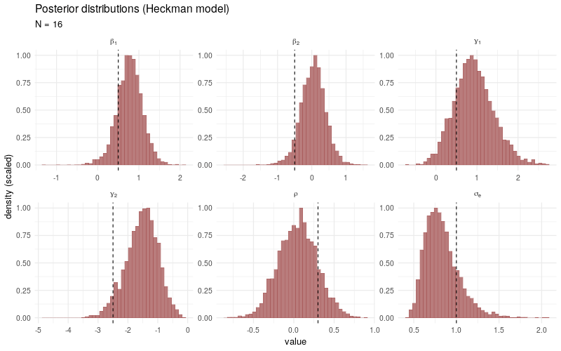
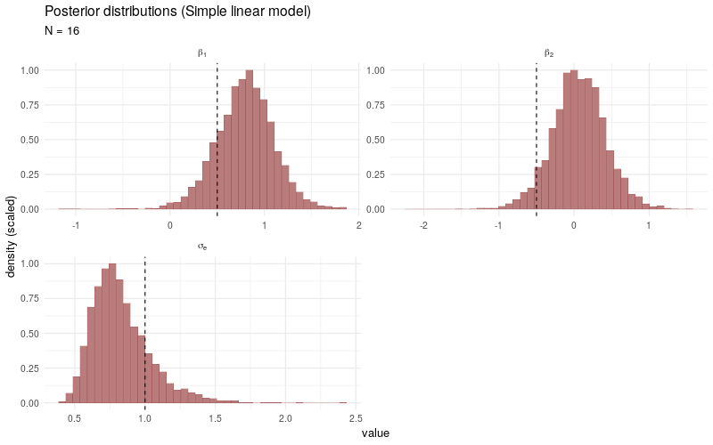

```{r setup, include=FALSE}
knitr::opts_chunk$set(collapse = TRUE, warning = FALSE, message = FALSE, eval = FALSE,
                      fig.align = "center", comment = "#>", out.width = "100%")
rstan::rstan_options(auto_write = TRUE)
```

# Introduction

## Selection bias

[Selection bias](https://en.wikipedia.org/wiki/Selection_bias) occurs when sampled data or subjects in a study have been selected in a way that is not representative of the population of interest. As a consequence, conclusions made about the analyzed sample may be difficult to generalize, as the observed effects could be biased towards the sample and do not necessarily extend well to the population that we intended to analyze. In light of the current COVID-19 pandemic, we can think of multiple examples of possible selection bias: (1) the elderly or participants with certain co-morbidities may be underrepresented in a COVID-19 vaccine trial, which makes it hard to analyze the treatment effects for this segment of the population; (2) individuals with strong symptoms may be more likely to get tested than individuals with no symptoms, implying that observed health risks among tested individuals may be more severe than in the general population; (3) surveys to evaluate the government's response in mitigating the disease spread may produce biased results, as citizens that decide to participate in a voluntary government survey may already have a more positive (or negative) view on the government's policies and decision making. 

In general, selection bias can manifest itself in different forms, such as [sampling bias](https://en.wikipedia.org/wiki/Sampling_bias), [self-selection bias](https://en.wikipedia.org/wiki/Self-selection_bias) (also a form of sampling bias), [survival bias](https://en.wikipedia.org/wiki/Survivorship_bias) or [allocation bias](https://catalogofbias.org/biases/allocation-bias/). The website https://catalogofbias.org/ gives a comprehensive overview of different types of bias (not only selection bias) that may be encountered in research studies and also provides a large number of illustrative examples. 

## Mroz dataset

A classical dataset demonstrating the effects of sampling bias is the **Mroz dataset** [@M87], versions of which are available in R through `Mroz87` in the `sampleSelection`-package or `Mroz` in the `car`-package. The dataset contains observations from a 1975 Panel Study of Income Dynamics (PSID) on married women's pay and labor force participation, as well as a number of descriptive variables, such as age, number of children and years of education. Based on the Mroz dataset, we can try to estimate a wage equation for married women in 1975 using the available descriptive variables. However, wages are only observed for women that participate in the labor-force, which introduces a form of selection bias in the observed sample. If this fact is not taken into account, the estimated effects (i.e. parameters) in the wage equation may suffer from a large bias, as a substantial proportion of married women in 1975 did not participate in the labor-force.

A simple and well-known model to correct for this specific type of selection bias is the Heckman selection model, or *Heckit model*, as studied in [@H79]. As an excercise, we will fit the Heckman selection model using Stan (and R) and evaluate the Stan model on simulated data as well as the `Mroz87` dataset. 

# Heckman selection model

## Model setup

In the Mroz dataset, wages are only observed for individuals that are participating in the labor-force, but labor-force participation itself can be determined for **each** individual. The Heckman selection model uses this fact by explicitly splitting the regression problem into a model for the response of interest and a model for the binary participation decision. The participation decision is always observed, but the response of interest is only observed if the participation decision is non-zero, thereby accounting for the biased sampling process. More precisely, the original Heckman selection model as in [@H79] is defined by the following two regression equations:

1. An outcome equation that represents the response of interest $\boldsymbol{Y} = (Y_1,\ldots,Y_N)' \in \mathbb{R}^N$ by a linear model based on the observed covariates $\boldsymbol{X} \in \mathbb{R}^{N \times p}$,
$$
Y_i = X_i' \boldsymbol{\beta} + \epsilon_i, \quad \text{for}\ i = 1,\ldots,N
$$
2. A selection equation that models a binary participation decision $\boldsymbol{D} = (D_1,\ldots,D_N) \in \mathbb{R}^N$ based on a second set of observed covariates $\boldsymbol{Z} \in \mathbb{R}^{N \times q}$,
$$
D_i = \boldsymbol{1}\{ Z_i'\boldsymbol{\gamma} + \eta_i  > 0 \}
$$

The covariates $\boldsymbol{X}$, $\boldsymbol{Z}$ and the participation decision $\boldsymbol{D}$ are always observed, but the response of interest $Y_i$ for individual $i$ is only observed if $D_i = 1$. In addition, the original Heckman model assumes joint normality for the error terms:

$$
\begin{pmatrix} \epsilon_i \\ \eta_i \end{pmatrix} \ \overset{\text{iid}}{\sim} \ N\left( \begin{pmatrix} 0 \\ 0 \end{pmatrix}, \begin{pmatrix} \sigma_e^2 & \rho \sigma_e \\ \rho \sigma_e & 1 \end{pmatrix} \right)
$$
Note that the error terms in the two regression equations are allowed to be correlated. The variance of $\eta_i$ is normalized to 1 as we only know the sign of $Z_i'\boldsymbol{\gamma} + \eta_i$ in observing $D_i$.

## Likelihood derivation

The main effort in writing a Stan program for the Heckman Selection model is in deriving the joint (log-)likelihood function of the parameters $\boldsymbol{\theta} = (\beta_1,\ldots,\beta_p, \gamma_1,\ldots,\gamma_q, \sigma_e^2, \rho)'$, given the covariates $\boldsymbol{X}$ and $\boldsymbol{Z}$ and the (partial) observations $\boldsymbol{D}$ and $\boldsymbol{Y}$. 

First, since the error terms $\epsilon_i, \eta_i$ are i.i.d. across individuals, the likelihood can be decomposed as:

$$
\begin{aligned}
L(\boldsymbol{\theta}) = & \prod_{i = 1}^N \Big[ (1 - D_i) \cdot P_{\boldsymbol{\theta}}(D_i = 0 | X_i, Z_i) \\
& \quad \quad + D_i \cdot P_{\boldsymbol{\theta}}(D_i = 1 | X_i, Z_i, Y_i) \cdot P_{\boldsymbol{\theta}}(Y_i = y_i | X_i, Z_i) \Big]
\end{aligned}
$$
If $D_i = 0$, we know nothing about $Y_i$, for this reason the only contribution to the likelihood if $D_i = 0$ is the probability that $D_i = 0$ itself, which can be simplified to:

$$
P_{\boldsymbol{\theta}}(D_i = 0 | X_i, Z_i) \ = \ P_{\boldsymbol{\theta}}(\eta_i < -Z_i'\boldsymbol{\gamma})
\ = \ \Phi(-Z_i' \boldsymbol{\gamma}) 
$$
where the last step uses that the marginal distribution of $\eta_i$ is a standard normal, i.e. $\eta_i \sim N(0, 1)$. Also, since $Y_i | X_i, \boldsymbol{\theta} \sim N(X_i' \boldsymbol{\beta}, \sigma_e^2)$, the probability that $Y_i = y_i$ is given by:

$$
P_{\boldsymbol{\theta}}(Y_i = y_i | X_i, Z_i) \ = \ \frac{1}{\sigma_e}\phi\left(\frac{y_i - X_i'\boldsymbol{\beta}}{\sigma_e}\right)
$$
The only term in the likelihood that remains is $P_{\boldsymbol{\theta}}(D_i = 1 | X_i, Z_i, Y_i)$. To find this probability, we use the fact that the conditional distribution of a bivariate normal is again normal with known mean and variance, see e.g. [Wikipedia](https://en.wikipedia.org/wiki/Multivariate_normal_distribution#Bivariate_case_2). Specifically, it can be verified that:

$$
\eta_i | X_i, Z_i, Y_i \ \sim \ N\left(\rho \frac{1}{\sigma_e}(y_i - X_i'\boldsymbol{\beta}), 1-\rho^2\right)
$$
Using this form for the conditional distribution of $\eta_i$, the probability that $D_i = 1$ can be written out as:

$$
\begin{aligned}
P_{\boldsymbol{\theta}}(D_i = 1 | X_i, Z_i, Y_i) & \ = \ P_{\boldsymbol{\theta}}(\eta_i > -Z_i'\boldsymbol{\gamma} | X_i, Z_i, Y_i) \\
& \ = \ 1 - \Phi\left( \frac{-Z_i'\boldsymbol{\gamma} - \rho\frac{1}{\sigma_e}(y_i - X_i'\boldsymbol{\beta}) }{\sqrt{1 - \rho^2}}    \right) \\ 
& \ = \ \Phi\left( \frac{Z_i'\boldsymbol{\gamma} + (\rho / \sigma_e) \cdot (y_i - X_i' \boldsymbol{\beta})}{\sqrt{1 - \rho^2}} \right)
\end{aligned}
$$
Combining the previous assertions, we arrive at the following expression for the log-likelihood:

$$
\begin{aligned}
\ell(\boldsymbol{\theta}) \ = \ & \sum_{i = 1}^N \Big[ (1 - D_i) \cdot \ln \Phi(-Z_i'\boldsymbol{\gamma}) + D_i \cdot \Big( \ln \phi((y_i - X_i'\boldsymbol{\beta}) / \sigma_e) - \ln \sigma_e \\
& \quad \quad + \ln \Phi((Z_i'\boldsymbol{\gamma} + (\rho / \sigma_e) \cdot (y_i - X_i'\boldsymbol{\beta})) \cdot (1 - \rho^2)^{-1/2} ))  \Big) \Big]
\end{aligned}
$$
Maximizing this log-likelihood turns out to be somewhat tricky in practice. For this reason, a two-stage estimator is considered in [@H79], which in a first step fits a [probit](https://en.wikipedia.org/wiki/Probit_model) model for the participation decision $\boldsymbol{D}$, and in a second step fits a modified version of the outcome equation for the response of interest $\boldsymbol{Y}$ by plugging in an inverse [Mills ratio](https://en.wikipedia.org/wiki/Mills_ratio) estimated in the first stage. The details of the two-stage estimator can be found in [@H79] or by a quick online search. 

In contrast to the maximum likelihood estimator, the two-stage estimator is not necessarily [efficient](https://en.wikipedia.org/wiki/Efficiency_(statistics)). Another disadvantage is that the estimation error in the first stage is not propagated to the second stage estimates, which makes it less straightforward[^1] to obtain (asymptotically) valid standard errors or confidence intervals for the parameters. With this in mind, a Bayesian sampling approach could bring something to the table. Firstly, exploring the entire space of posterior distributions should be computationally more robust than direct optimization of the likelihood. Secondly, all parameters are sampled in a joint framework (based on the derived likelihood), so we have direct access to valid credible intervals as well as other statistics of interest derived from the posteriors. 

## Model implementation in Stan

The following Stan program implements the Heckman selection model by directly incrementing the `target` total log probability function based on the derived log-likelihood:

```{stan output.var="heckman_model"}
data {
  // dimensions
  int<lower=1> N;
  int<lower=1, upper=N> N_y;
  int<lower=1> p;
  int<lower=1> q;
  // covariates
  matrix[N_y, p] X;
  matrix[N, q] Z;
  // responses
  int<lower=0, upper=1> D[N];
  vector[N_y] y;
}
parameters {
  vector[p] beta;
  vector[q] gamma;
  real<lower=-1,upper=1> rho;
  real<lower=0> sigma_e;
}
model {
  // naive (truncated) priors
  beta ~ normal(0, 1);
  gamma ~ normal(0, 1);
  rho ~ normal(0, 0.25);
  sigma_e ~ normal(0, 1);
  {
    // log-likelihood
    vector[N_y] Xb = X * beta;
    vector[N] Zg = Z * gamma;
    int ny = 1;
    for(n in 1:N) {
      if(D[n] > 0) {
        target += normal_lpdf(y[ny] | Xb[ny], sigma_e) + log(Phi((Zg[n] + rho / sigma_e * (y[ny] - Xb[ny])) / sqrt(1 - rho^2)));
        ny += 1; 
      }
      else {
        target += log(Phi(-Zg[n]));
      }
    }
  }
}

```


## Simulated data

Saving the Stan program to a file `heckman.stan`, we first compile the model in R with `rstan::stan_model()`:

```{r, eval = TRUE}
library(rstan)

## compile the model 
heckman_model <- stan_model(file = "heckman.stan")
```

Next, we generate a simulated dataset and check the parameter estimates obtained by fitting the Stan model. The simulated data is generated from the exact same Heckman selection model setup as described above. The parameters and covariate matrices have been selected to induce a certain degree of correlation between the participation decision $D_i$ and the response $Y_i$, and the total number individuals with an observed participation decision $D_i$ is set to $N = 512$. Note that all responses $Y_i$ for which $D_i = 0$ are discarded from the simulated data[^2], as these responses *cannot* be observed in practice.

```{r, eval = TRUE}
## parameters
N <- 512
beta <- c(0.5, -0.5)
gamma <- c(0.5, -2.5)
sigma_e <- 1
rho <- 0.3

## simulate correlated covariates and noise
set.seed(0)
X <- cbind(rep(1, N), rnorm(N))
Z <- X
Sigma <- matrix(c(sigma_e^2, rho * sigma_e, rho * sigma_e, 1), ncol = 2)
e <- MASS::mvrnorm(N, mu = c(0, 0), Sigma = Sigma)

## generate responses
D <- 1L * c(Z %*% gamma + e[, 2] > 0)
y <- (X %*% beta + e[, 1])[D > 0]

## fit model to simulated data
model_fit <- sampling(
  object = heckman_model, 
  data = list(N = N, N_y = length(y), p = length(beta), q = length(gamma), X = X[D > 0, ], Z = Z, D = D, y = y)
)

model_fit
```
Looking at the sampling results returned by `rstan::sampling()`, we observe no obvious sampling problems. The posterior distributions all cover the target parameters reasonably well (using a total of $N = 512$ observations) and all Markov chains seem to have converged correctly. From the generated pairs plot of the posterior samples, we see that the posterior densities behave nicely and we cannot discern any clearly problematic regions in the sampled parameter space, (although there is a high degree of correlation between the posterior samples for the $\beta$ parameters and the $\rho$ parameter).

```{r, eval = TRUE, fig.height = 10, fig.width = 10}
library(bayesplot)

## pairs plot of posteriors
color_scheme_set("red")
mcmc_pairs(model_fit, pars = c("beta[1]", "beta[2]", "gamma[1]", "gamma[2]", "rho", "sigma_e"), off_diag_fun = "hex")
```

The animated plot below demonstrates the convergence of the posterior distributions to the target parameters when the number of total observations $N$ increases. The data simulation and sampling procedures (1000 post-warmup draws across 4 individual chains) are the same as before, only the number of observations $N$ is varied in each model fit.


As a benchmark comparison, we generate the same animated plot showing the posterior distributions sampled from a simple linear model fitted **only** to the selected observations $Y_i$ with $D_i > 0$. As $N$ increases, the posterior distributions no longer converge[^3] to the target parameters, which is due to the fact that the sampling bias introduced by the participation decision $D_i$ is not taken into account. 



For completeness, the Stan program used to fit the simple linear models is coded as follows:

```{stan output.var="linear_model"}
data {
  int<lower=1> N_y;
  int<lower=1> p;
  matrix[N_y, p] X;
  vector[N_y] y;
}
parameters {
  vector[p] beta;
  real<lower=0> sigma_e;
}
model {
  beta ~ normal(0, 1);
  sigma_e ~ normal(0, 1);
  y ~ normal(X * beta, sigma_e);
}

```

## Case study: Mroz dataset

As a real data example, we will estimate a log-wage equation for married women in 1975 based on the `Mroz87` dataset in the same spirit as [@M87]. The response of interest is the `log(wage)` variable, the log-wage in dollars, and the participation decision is encoded in the binary labor-force participation variable `lfp`. 
The outcome equation for the `log(wage)` response is modeled as a function of: `age` (age in years), `educ` (years of education), `huswage` (husband's wage in dollars) and `exper` (previous worked years). The participation decision is modeled based on: `age`, `educ`, `hushrs` (husband's hours worked), `husage` (husband's age), `huswage` and `kids5` (number of children younger than 6).

As the Stan model is already compiled, the only work that remains is defining the model responses and covariates passed as inputs to `rstan::sampling()`. Note that we normalize[^4] the covariates to have mean zero and standard deviation 1.

```{r, eval = TRUE}
library(sampleSelection)
data("Mroz87")

## covariates and response outcome equation
X <- model.matrix(~ age + educ + huswage + exper + I(exper^2), data = Mroz87)
X[, -1] <- apply(X[, -1], 2, scale) ## normalize variables
X <- X[Mroz87$lfp > 0, ]  
y <- log(Mroz87$wage)[Mroz87$lfp > 0]  ## response

## covariates and response selection equation
Z <- model.matrix(~ age + educ + hushrs + husage + huswage + kids5, data = Mroz87)
Z[, -1] <- apply(Z[, -1], 2, scale)  ## normalize variables
D <- Mroz87$lfp  ## participation decision

## fit Heckman selection model
model_fit <- rstan::sampling(
  object = heckman_model, 
  data = list(N = length(D), N_y = length(y), p = ncol(X), q = ncol(Z), X = X, Z = Z, D = D, y = y)
)

model_fit
```
Looking at the sampling results, all chains converged correctly and it seems that the model experienced no obvious issues in sampling from the posterior distributions. Below, we plot the posterior medians for the $\beta$ and $\gamma$ parameter vectors including 50% and 95% credible intervals:

```{r, eval = TRUE}
## posterior interval plots
samples <- as.matrix(model_fit)[, c(2:6, 8:13)]
colnames(samples) <- c("age (beta)", "educ (beta)", "huswage (beta)", "exper (beta)", "exper^2 (beta)", "age (gamma)", "educ (gamma)", "hushrs (gamma)", "husage (gamma)", "huswage (gamma)", "kids5 (gamma)")

mcmc_intervals(samples, point_est = "median", prob = 0.5, prob_outer = 0.95)
```
Some observations we can make from the plotted posterior intervals is that age correlates with participation in the labor-force market, but apparently has no clear effect on the wage of the observed participants. A variable that *does* highly correlate with the wage is the number previous years worked, which is not too surprising. Also, more years of received education has a positive effect on labor-force participation, whereas having young children has a negative effect on labor-force participation, which seems quite intuitive as well.

To conclude, we compare these results to the results obtained by fitting the same Heckman selection model using the two-stage estimator of [@H79] and direct maximum likelihood estimation with `sampleSelection::heckit()`. The two-stage and maximum likelihood estimators return more or less the same parameter estimates, but only the maximum likelihood estimator calculates standard errors for $\sigma_e$ and $\rho$. Moreover, the parameter estimates correspond very well to the posterior medians plotted above, so it seems safe to conclude that the Stan model behaves as expected.

```{r, eval = TRUE}
## select variables and normalize
Mroz87_new <- Mroz87[, c("wage", "lfp", "age", "educ", "huswage", "exper", "hushrs", "husage", "kids5")]
Mroz87_new <- transform(Mroz87_new, exper_2 = exper^2)
Mroz87_new[, 3:10] <- apply(Mroz87_new[, 3:10], 2, scale)

## two-stage estimator
twostage_fit <- heckit(
  selection = lfp ~ age + educ + hushrs + husage + huswage + kids5,
  outcome = log(wage) ~ age + educ + huswage + exper + exper_2,
  method = "2step",
  data = Mroz87_new
)

summary(twostage_fit)

## maximum likelihood estimator
ml_fit <- heckit(
  selection = lfp ~ age + educ + hushrs + husage + huswage + kids5,
  outcome = log(wage) ~ age + educ + huswage + exper + exper_2,
  method = "ml",
  data = Mroz87_new
)

summary(ml_fit)
```

# Session Info

```{r, eval = TRUE}
sessionInfo()
```

# References

[^1]: correct standard errors and confidence intervals could be obtained using resampling techniques, such as [bootstrapping](https://en.wikipedia.org/wiki/Bootstrapping_(statistics))

[^2]: this should be around half of the $Y_i$'s, since $\sum_i \mathbb{E}[D_i] = N /2$ due to the way the simulated data is generated

[^3]: by this we mean convergence in distribution to degenerate distributions located at the target parameters

[^4]: the normalization is done with respect to all available observations, and *not* only the observations with `lfp > 0`
