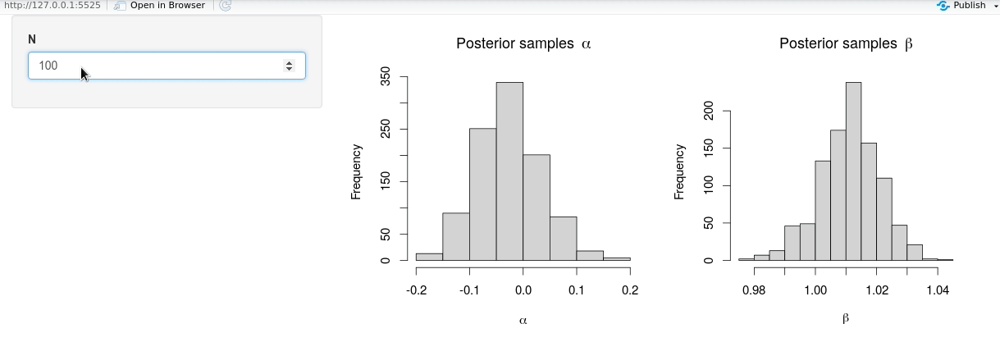
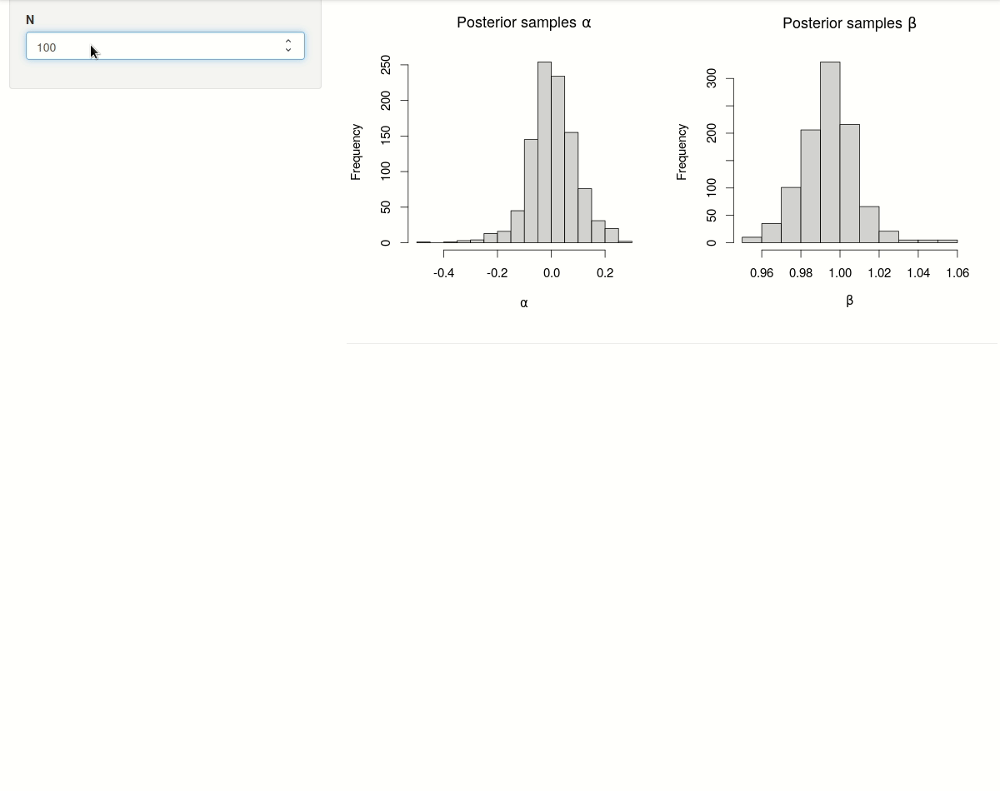
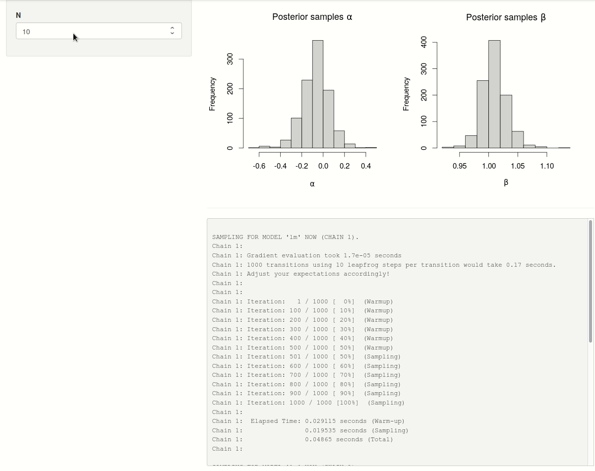

```{r setup, include=FALSE}
knitr::opts_chunk$set(collapse = TRUE, warning = FALSE, message = FALSE, eval = FALSE,
                      fig.align = "center", comment = "#>", out.width = "100%")
```

# Introduction

The [previous post](/2021/02/01/running-stan-models-in-shiny) demonstrates the use of pre-compiled [Stan](https://mc-stan.org/) models in interactive [R Shiny](https://shiny.rstudio.com/) applications to avoid unnecessary Stan model (re-)compilation on application start-up. In this short follow-up post we go a step further and tackle the issue of tracking the Stan model sampling progress itself in a shiny-application. The idea, mainly inspired by [this blog post](https://discindo.org/post/asynchronous-execution-in-shiny/), is to execute the Stan model sampling in a separate background R process using the convenient [`callr`](https://callr.r-lib.org/)-package to avoid blocking of the shiny-application.

## Demo Shiny-app

For illustration purposes, we start from the basic shiny-app in the previous post that fits a simple linear model in Stan and plots the sampled posteriors:

```{r}
library(shiny)

ui <- fluidPage(
  sidebarLayout(
    sidebarPanel(
      numericInput("N", label = "N", value = 10)
    ),
    mainPanel(
      plotOutput("posteriors")
    )
  )
)

server <- function(input, output, session) {
  ## draw samples 
  draws <- reactive({
    N <- input$N
    rstan::sampling(
      object = shinyStanModels:::stanmodels[["lm"]],
      data = list(N = N, x = seq_len(N), y = rnorm(N, seq_len(N), 0.1)),
      chains = 2,
      iter = 1000
    )
  })
  ## plot histograms
  output$posteriors <- renderPlot({
    req(draws())
    op <- par(mfrow = c(1, 2), cex = 1.25)
    hist(rstan::extract(draws(), "alpha")[[1]], main = bquote("Posterior samples"~alpha), xlab = expression(alpha))
    hist(rstan::extract(draws(), "beta")[[1]], main = bquote("Posterior samples"~beta), xlab = expression(beta))
    par(op)
  })
  
}

shinyApp(ui = ui, server = server)
```



**Note**: here the pre-compiled `"lm"` Stan model is called from a dummy R-package `shinyStanModels` as explained [previously]([previous post](/2021/02/01/running-stan-models-in-shiny)) to avoid model recompilation every time the shiny-app is launched.

## Shiny-app blocking

By increasing the number observations $N$, we also increase the execution time of the MCMC sampling process. Setting e.g. $N = 500$, it already takes quite a while for the computations to complete[^1]. Unfortunately, there is no way to tell from the shiny-app whether the sampling iterations are progressing quickly or still require a long time to finish. In an interactive R-session, the progress of the sampling iterations across individual chains is either printed to the console (that is, the current `stdout` connection) or to a temporary file when multiple chains are being sampled in parallel. It would be great if we could divert these progress messages to the shiny-app itself, so that the sampling iterations can be tracked in real-time in the same way as in any interactive R-session.

A first idea that comes to mind is to make use of shiny's `reactivePoll()` or `reactiveFileReader()` to periodically read the contents of the temporary progress file generated by Stan, and display these contents in reactively in the shiny-app. The problem, however, is that due to shiny's synchronous reactive nature the shiny-app is effectively **blocked** while executing the sampling process, and the `reactiveFileReader()` will only have a chance to read the progress file when the model sampling is already finished, thereby defeating its purpose.

Instead, we have to somehow detach the slow model sampling process from the main shiny-app process so that both processes do not interfere with each other and the shiny-app is free to execute other requests. In fact, what is needed is a way to launch the sampling process in a separate background R-process, and, as it turns out, this is exactly what is provided by the convenient `callr`-package.

# Unblocking a shiny-app with `callr`

In order to execute the Stan model sampling procedure in a separate R-process, we wrap the call to `rstan::sampling()` in a function and pass it to the `func` argument of `callr::r_bg()`. The function is evaluated in a background R-process and may take a long time to complete, but `callr::r_bg()` **immediately** returns control to the current R-process so that it is free to perform other operations:

```{r, eval = TRUE}
library(callr)

## launch job in separate R process
r_process <- r_bg(
  func = function(N) {
    rstan::sampling(
      object = shinyStanModels:::stanmodels[["lm"]],
      data = list(N = N, x = seq_len(N), y = rnorm(N, seq_len(N), 0.1)),
      open_progress = FALSE,
      chains = 2,
      iter = 1000
    )
  },
  args = list(N = 500)
)

## the process object is returned immediately
## and can be polled from the current R process
r_process

## check if job is still running
r_process$is_alive()

## result is not yet available
tryCatch(r_process$get_result(), error = function(e) e$message)

## extract the result when the job is finished
system.time({
  r_process$wait()
})
r_process
r_process$get_result()
```

**Note**: launching a separate R-process does not necessarily require a multi-core processor and also works using only a single-core processor. On the other hand, the R-session does need to have sufficient permission/rights to launch a separate R-process on the system. 

## Demo Shiny-app (continued)

In a first step, we update the shiny-app by wrapping the `rstan::sampling()` call in a call to `callr::r_bg()` so that the execution of the model sampling no longer blocks the shiny-app process. Using the `stdout` argument of `callr::r_bg()` we can divert[^2] all messages generated by `rstan::sampling()` (and printed to `stdout`) to a temporary file `tfile`. 

Whenever the number of observations $N$ is changed and a new background R-process is launched, we instruct the shiny-app to start polling the process object (`r$bg_process`) by updating the reactive value `r$poll`. This will trigger an observer to: (1) read and assign the contents of the progress file `tfile` to a reactive value `r$progress` whenever the progress file has been modified; (2) check if the background process has finished executing and if this is the case retrieve the sampling results. The observer will be re-executed every second and only stops re-executing when the background process is no longer alive and `r$poll` has been turned off (i.e. set to `FALSE`). 

The progress messages can now be rendered in real-time in the shiny-app by simply pasting the contents of the reactive value `r$progress`. The posterior histograms only need to be updated whenever new sampling results are available in the reactive value `r$draws`. 

In short, we can summarize the updated shiny-app with the following graph:

```{r, eval = TRUE, echo = FALSE}
DiagrammeR::mermaid("
graph TB
   A[Update N] --> B[Start sampling in background process];
   B --> B2[Background process is alive?];
   B2 -->|Yes| C[\"Read progress file (if modified)\"];
   C --> B2;
   B2 -->|No| F1[Extract sampling results];
   F1 --> G[Plot posterior histograms];
  ", height = 350)
```

More importantly, the updated shiny-app --including model sampling progress-- now looks as follows:

```{r}
library(shiny)

ui <- fluidPage(
  sidebarLayout(
    sidebarPanel(
      numericInput("N", label = "N", value = 10)
    ),
    mainPanel(
      plotOutput("posteriors"),
      hr(),
      ## limit the height of the progress message box
      tags$head(tags$style("#progress{overflow-y:scroll; max-height: 500px;}")),
      verbatimTextOutput("progress")
    )
  )
)

server <- function(input, output, session) {
  
  ## file to write progress
  tfile <- tempfile(fileext = ".txt")
  
  ## reactive values
  r <- reactiveValues(
    progress_mtime = -1
  )
  
  observeEvent(input$N, {
    ## start sampling in background process
    r$bg_process <- callr::r_bg(
      ## this is a long running computation
      func = function(N) {
        rstan::sampling(
          object = shinyStanModels:::stanmodels[["lm"]],
          data = list(N = N, x = seq_len(N), y = rnorm(N, seq_len(N), 0.1)),
          open_progress = FALSE,
          iter = 1000,
          chains = 2
        )
      },
      args = list(N = input$N),
      stdout = tfile,
      supervise = TRUE
    )
    ## start polling bg process
    r$poll <- TRUE   
  })
  
  ## observe status of bg process
  observe({
    req(r$bg_process, r$poll)
    ## keep re-executing observer as 
    ## long as bg process is running
    invalidateLater(millis = 1000, session)
    ## read current progress if file is modified
    mtime <- file.info(tfile)$mtime
    if(mtime > r$progress_mtime) {
      r$progress <- readLines(tfile) 
      r$progress_mtime <- mtime
    }
    ## extract draws when bg process is finished
    if(!r$bg_process$is_alive()) {
      r$draws <- r$bg_process$get_result()
      r$poll <- FALSE  ## stop polling bg process
    } 
  })
  
  ## plot histograms
  output$posteriors <- renderPlot({
    req(r$draws)
    op <- par(mfrow = c(1, 2), cex = 1.25)
    hist(rstan::extract(r$draws, "alpha")[[1]], main = bquote("Posterior samples"~alpha), xlab = expression(alpha))
    hist(rstan::extract(r$draws, "beta")[[1]], main = bquote("Posterior samples"~beta), xlab = expression(beta))
    par(op)
  })
  
  ## print progress
  output$progress <- renderText({
    req(r$progress)
    paste(r$progress, collapse = "\n")
  })
  
}

shinyApp(ui = ui, server = server)
```

```{r eval=TRUE, echo=FALSE, out.width="100%", fig.cap="Progress of sampling iterations with two chains (in parallel) on a multi-core processor"}

```

```{r eval=TRUE, echo=FALSE, out.width="100%", fig.cap="Progress of sampling iterations with two chains (in sequence) on a single-core processor[^3]"}

```

# Session Info

```{r, eval = TRUE, echo = FALSE}
sessionInfo()
```


[^1]: this Stan program could be made more efficient by specifying reasonable priors, but that is not the purpose of this illustration.

[^2]: this approach also works when multiple chains are sampled in parallel, i.e. if the `cores` argument in `rstan::sampling()` is larger than 1.

[^3]: here the shiny-app is launched in an isolated docker container with a limit on the cpu-usage (https://docs.docker.com/config/containers/resource_constraints/#cpu)