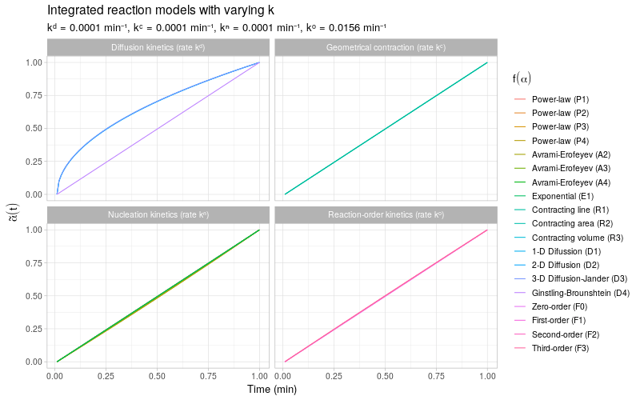

```{r knitr, echo = FALSE, results = 'hide'}
library(knitr)
library(kableExtra)
library(ggplot2)
library(data.table)
knitr::opts_chunk$set(collapse = TRUE, warning = FALSE, message = FALSE, fig.align = 'center', comment = "#>")

bayesplot::color_scheme_set("red")

# save the built-in output hook
hook_output <- knitr::knit_hooks$get("output")

# set a new output hook to truncate text output
knitr::knit_hooks$set(output = function(x, options) {
  if (!is.null(n <- options$out.lines)) {
    x <- xfun::split_lines(x)
    if (length(x) > n) {
      # truncate the output
      x <- c(head(x, n), "....\n")
    }
    x <- paste(x, collapse = "\n")
  }
  hook_output(x, options)
})
```

# Introduction

In chemical kinetics, the rate of a solid-state reaction is generally modeled by a reaction rate law (or rate equation) of the form:

$$
\frac{d\alpha}{dt} \ = \ k \cdot f(\alpha)\ = \ Ae^{-E_a/RT} \cdot f(\alpha)
$$

Here, $\alpha(t) \in [0,1]$ is the reaction's conversion fraction in time and $f(\alpha)$ is the **reaction model**. The reaction rate constant $k = Ae^{E_a / RT}$ is represented by an [Arrhenius equation](https://en.wikipedia.org/wiki/Arrhenius_equation) based on the absolute temperature $T$, model parameters $A$ (pre-exponential factor) and $E_a$ (activation energy), and ideal gas constant $R$. The reaction model $f(\alpha)$ can take on many different forms based on mechanistic considerations or empirical observation. The following table provides a list of common reaction models for $f(\alpha)$ taken from [@KF06] describing various types of reaction kinetics:

```{r, echo=F}
models <- data.frame(fa = c("$2 \\alpha^{1/2}$", "$3 \\alpha^{2/3}$", "$4 \\alpha^{3/4}$", 
                            "$2(1 - \\alpha)[-\\ln(1 - \\alpha)]^{1/2}$", "$3(1-\\alpha)[-\\ln(1-\\alpha)]^{2/3}$",
                            "$4(1-\\alpha)[-\\ln(1-\\alpha)]^{3/4}$", "$2(1-\\alpha)^{1/2}$", 
                            "$3(1-\\alpha)^{2/3}$", "$1/(2\\alpha)$", "$-[1/\\ln(1-\\alpha)]$",
                            "$[3(1-\\alpha)^{2/3}]/[2(1-(1-\\alpha)^{1/3})]$", "$3/[2((1-\\alpha)^{-1/3}-1)]$", 
                            "$1$", "$(1-\\alpha)$", "$(1-\\alpha)^2$", "$(1-\\alpha)^3$", "$\\alpha$"))
rownames(models) <- c("Power-law (P2)", "Power-law (P3)", "Power-law (P4)", "Avrami-Erofeyev (A2)", "Avrami-Erofeyev (A3)", 
                      "Avrami-Erofeyev (A4)", "Contracting area (R2)", "Contracting volume (R3)", 
                      "1-D Difussion (D1)", "2-D Diffusion (D2)", "3-D Diffusion-Jander (D3)", "Ginstling-Brounshtein (D4)",
                      "Zero-order (P1/R1/F0)", "First-order (F1)", "Second-order (F2)", "Third-order (F3)", "Exponential (E1)")

kbl(models,
    col.names = "Reaction model $f(\\alpha)$",
    row.names = TRUE,
    align = "l"
) %>%
  kable_styling()
```

Using `deSolve::ode()`, we can integrate the kinetic trends for all listed reaction models $f(\alpha)$ with a fixed rate constant $k$:

```{r}
library(deSolve)

alpha <- ode(
  y = c(P2 = 0, P3 = 0, P4 = 0, A2 = 0, A3 = 0, A4 = 0, R2 = 0, R3 = 0, D1 = 0, 
        D2 = 0, D3 = 0, D4 = 0, F0 = 0, F1 = 0, F2 = 0, F3 = 0, E1 = 1) + 1E-6,
  times = (1:100)/100,
  func = function(t, y, parms) {
    list(
      dadt = parms["k"] * c(
        P2 = 2 * sqrt(y[1]),
        P3 = 3 * y[2]^(2/3),
        P4 = 4 * y[3]^(3/4),
        A2 = 2 * (1 - y[4]) * sqrt(-log(1 - y[4])),
        A3 = 3 * (1 - y[5]) * (-log(1 - y[5]))^(2/3),
        A4 = 4 * (1 - y[6]) * (-log(1 - y[6]))^(3/4),
        R2 = 2 * sqrt(1 - y[7]),
        R3 = 3 * (1 - y[8])^(2/3),
        D1 = 1 / (2 * y[9]),
        D2 = -1 / log(1 - y[10]),
        D3 = 3 * (1 - y[11])^(2/3) / (2 * (1 - (1 - y[11])^(1/3))),
        D4 = 3 / (2 * (1 - y[12])^(-1/3) - 1),
        F0 = 1,
        F1 = 1 - y[14],
        F2 = (1 - y[15])^2,
        F3 = (1 - y[16])^3,
        E1 = y[17]
      )
    )
  },
  parms = c(k = 0.5)
)

head(alpha)
```

We plot all integrated kinetic trends in a single display by rescaling the trends $\alpha(t)$ to the unit interval. This provides a quick overview of the different types of reaction kinetics represented by the reaction models $f(\alpha)$.

```{r, echo=F, fig.dim=c(9, 5)}
alpha <- rbind(c(time = 0, P2 = 0, P3 = 0, P4 = 0, A2 = 0, A3 = 0, A4 = 0, R2 = 0, R3 = 0, 
                 D1 = 0, D2 = 0, D3 = 0, D4 = 0, F0 = 0, F1 = 0, F2 = 0, F3 = 0, E1 = 1), alpha)
alpha <- apply(alpha, 2, function(x) (x - head(x, 1)) / diff(range(x)))
colnames(alpha) <-  c("time", "Power-law (P2)", "Power-law (P3)", "Power-law (P4)", "Avrami-Erofeyev (A2)", "Avrami-Erofeyev (A3)", 
                      "Avrami-Erofeyev (A4)", "Contracting area (R2)", "Contracting volume (R3)", 
                      "1-D Difussion (D1)", "2-D Diffusion (D2)", "3-D Diffusion-Jander (D3)", "Ginstling-Brounshtein (D4)",
                      "Zero-order (P1/R1/F0)", "First-order (F1)", "Second-order (F2)", "Third-order (F3)", "Exponential (E1)")
alpha <- as.data.table(alpha)
alpha <- melt(alpha, id.vars = "time")
ggplot(alpha, aes(x = time, y = value, color = variable)) + 
  geom_line() + 
  theme_light() + 
  labs(x = "Time (min)", y = expression(tilde(alpha)(t)), title = "Integrated reaction models (k = 0.5 min\u207B\u00B9)", subtitle = expression(tilde(alpha)(t) == (alpha(t) - alpha(0)) / (alpha(1) - alpha(0)))) + 
  guides(color = guide_legend(title = expression(f(alpha))))
```

To get a more detailed view of the available types of kinetic behavior, we integrate the same kinetic trends by also varying the rate constant $k$. The reaction models are grouped by the same categories as described in [@KF06, Table 1].



Note that most of the reaction models $f(\alpha)$ shown here are different representations of the following general form: 

$$
f(\alpha) \ \propto \ \alpha^m(1 - \alpha)^n(-\ln(1 - \alpha))^p
$$
By varying the constants $m$, $n$, and $p$, many different types of reaction kinetics behavior can be generated and modeled.

## Statistical modeling

The aim of this post is to demonstrate the use of [Stan](https://mc-stan.org/) in the context of estimation and prediction of reaction kinetics based on observed data. In practice, the go-to approach to fit any of the above reaction models to observed data is likely least squares (or maximum likelihood) optimization, as this is the most convenient to implement in most mathematical programming languages. The least squares model fits allow us to quickly assess which reaction models provide reasonable fits to the data, but statistical inference (e.g. construction of confidence regions) for the estimated kinetic trends is not always straightforward due to the nonlinear nature (or missing closed-form solutions) of the integrated reaction models.

In the following demonstrating examples, we benefit from Stan's ODE solvers to assess the complete posterior distributions of the reaction model parameters and integrated reaction trends. Bayesian inference directly provides us with valuable information on the uncertainty in the estimated kinetic trends. In addition, because of Stan's flexible and efficient modeling interface, it is possible to build more complex statistical models involving numerically integrated reaction models and/or (highly) correlated model parameters.

**Note**: the Stan programs in this post are compiled with `cmdstanr` based on CmdStan **>= 2.24**. Stan 2.24 introduces new `ode_***` functions that avoid packing and unpacking schemes required by the now deprecated `integrate_ode_***` functions in previous Stan versions[^1].

# Example 1: Error propagation

## Model scenario

Consider a fictional scenario where $\alpha(t)$ is known to follow a first-order reaction model:

$$
\frac{d\alpha}{dt} \ = \ k \cdot f(\alpha) \ = \ Ae^{-E_a/RT} \cdot (1 - \alpha)
$$
Instead of observing $\alpha(t)$ directly, we observe a set of normally distributed rate constants $k_1, \ldots, k_S$ centered around $k = A e^{-E_a/RT}$. That is, 

$$
k_s | A, E_a, \sigma \overset{\text{iid}}{\sim} N(A e^{-E_a/RT}, \sigma^2) \quad \text{for} \ \ s = 1, \ldots, S
$$

The aim of this exercise is to predict the integrated trend $\alpha(t)$ based on the Arrhenius model fitted to the observations $k_1, \ldots, k_S$.

**Note**: the integrated first-order reaction model has a simple closed-form solution,

$$
\alpha(t) \ = \ 1 - e^{-kt}
$$
For the sake of generality, we solve for $\alpha(t)$ based on its differential form, as not all reaction models listed above have such straightforward closed-form solutions. Moreover, in terms of model sampling it should make no real difference for Stan[^2] whether $\alpha(t)$ is represented by its integrated form or integrated from its differential form using one of Stan's ODE solvers. 

### Simulated data

A set of observed i.i.d. rate constants $k_1,\ldots, k_S$ is simulated with 8 observations at each of three absolute temperatures $T = \{273.15, 293.15, 313.15\}$. The model parameters $A$ and $E_a$ in the Arrhenius equation are specified as $A = 1 \times 10^{15}\ \text{min}^{-1}$ and $E_a = 80\ \text{kJ/mol}$ identical to [@KF06, Figure 2] and the noise variance is set to $\sigma = 2$.

```{r}
## Arrhenius model parameters
set.seed(1)
pars <- list(log_A = log(1E15), Ea = 80, sigma = 2)
temp_K <- rep(c(283.15, 293.15, 313.15), each = 8)

## simulated observations
k_obs <- with(
  pars,
  data.frame(
    temp_K = temp_K,
    k = rnorm(n = length(temp_K), mean = exp(log_A - Ea / (0.00831446 * temp_K)), sd = sigma)
  )
)
```

```{r, echo = F, fig.dim = c(9, 4), out.width = "100%"}
trend <- data.frame(
  temp_K = seq(from = 283.15, to = 313.15, length = 100),
  k = exp(pars[["log_A"]] - pars[["Ea"]] / (0.00831446 * seq(from = 283.15, to = 313.15, length = 100)))
)

ggplot(data = trend) + 
  geom_line(aes(x = temp_K, y = k)) + 
  geom_point(data = k_obs, aes(x = temp_K, y = k), size = 2) + 
  theme_light() + 
  labs(title = bquote("Sampled rate constants"~k[obs]~"from Arrhenius signal plus noise model"), x = "Temperature (K)", y = "Rate constant k (min\u207B\u00B9)")
```

## Maximum likelihood

Firstly, given the observations $k_1,\ldots,k_S$, we can compute maximum likelihood estimates $\hat{A}$ and $\hat{E}_a$ by fitting the Arrhenius model $k_s \sim N(A e^{-E_a/RT}, \sigma^2)$ as a generalized linear model with Gaussian error distribution and a log-link function:

```{r}
## 1) Arrhenius model fit
glmfit <- glm(k ~ 1 + I(-1 / (0.0083144 * temp_K)), family = gaussian(link = "log"), data = k_obs)
summary(glmfit)
```

Next, by evaluating the fitted GLM at a specific temperature (e.g. $T = 298.15 K$), we obtain a point estimate $\hat{k}(T)$, which can be plugged into the reaction model to predict the reaction kinetics at the specified temperature:  

```{r}
## 2) evaluate k-hat at room temperature
khat <- predict(glmfit, newdata = list(temp_K = 298.15), type = "response")
khat

## 3) integrate alpha(t) by plugging in k-hat
alpha <- ode(
  y = c(alpha = 0),
  times = (0:100)/100,
  func = function(t, y, parms) list(khat * (1 - y))
)

head(alpha)
```

The following plot displays three such individual trajectories evaluated at three different temperatures:

```{r, echo = F, fig.dim = c(9, 5.5)}
predfun <- function(fit, temp_k, times) {
  lapply(temp_k, function(itemp_k) {
    k <- predict(fit, newdata = list(temp_K = itemp_k), type = "response")
    itrend <- as.data.table(
      ode(
        y = c(alpha = 0),
        times = times,
        func = function(t, y, parms) list(k * (1 - y))
      )
    )
    itrend[, temp_k := itemp_k]
  })
}

predicted <- rbindlist(
  predfun(
    glmfit,
    temp_k = c(283.15, 298.15, 313.15),
    times = (0:100)/100
  )
)

ggplot(predicted, aes(x = time, y = alpha, color = as.factor(temp_k))) + 
  geom_line() + 
  theme_light() + 
  labs(title = bquote("Integrated reaction model trajectories"~alpha(t)), x = "Time (min)", y = expression(alpha(t))) + 
  guides(color = guide_legend(title = "Temp. (K)"))
```

Here the integrated trajectories are evaluated as deterministic curves conditional on the point estimates $\hat{k}(T)$. Propagating the estimation error in $\hat{k}(T)$ to the solution of the ODE is a not a trivial task and probably requires the use of computationally intensive Monte Carlo simulation or other (re)sampling techniques, such as *bootstrapping*.

## MCMC sampling

A sensible solution to the previous issue is to simulate the posterior distribution of the integrated trajectories by means of Bayesian MCMC sampling. In Stan, we can combine both the initial generalized linear model fit and the integration of the reaction model making use of Stan's ODE solvers. Since the numerical integration of the ODE is not part of the model itself, it is performed in the `generated quantities` block of the Stan program. Using the new [`ode_rk45`](https://mc-stan.org/docs/2_26/functions-reference/functions-ode-solver.html) function available in Stan >= 2.24, the Stan model can be encoded as follows:

```{stan output.var="ex1_model", eval = FALSE}
// ex1.stan (Stan >= 2.24)
functions {
  // derivative function
  vector deriv(real time, vector y, real k) {
    vector[1] dydt = k * (1 - y);
    return dydt;
  }
}
data {
  // rate estimation
  int<lower = 1> n;
  vector[n] k_obs;  // observed rate constants (1/min)
  vector[n] temp_K; // observed temperatures (K)
  // ode integration
  int<lower = 1> n1;
  vector[1] y0;
  real times[n1];   // evaluated time points (min)
  real temp_K_new;  // evaluated temperature (K) 
}
parameters {
  real lnA;                 // pre-exponential factor
  real<lower = 0> Ea;       // activation energy
  real<lower = 1E-6> sigma; // error standard deviation                  
}
model {
  // (naive) priors
  lnA ~ normal(25, 10);
  Ea ~ normal(50, 10);
  sigma ~ normal(0, 1);
  // likelihood
  k_obs ~ normal(exp(lnA - Ea ./ (0.0083144 * temp_K)), sigma); 
}
generated quantities {
  vector[1] y_new[n1];
  // predicted rate constant
  real k_hat = exp(lnA - Ea / (0.0083144 * temp_K_new));
  // integrated reaction model
  y_new = ode_rk45(deriv, y0, 0.0, times, k_hat); 
}

```

The GLM likelihood is specified in the `model` block and we assign (*weakly informative*) normal priors for the model parameters: $\ln(A)$ (natural logarithm of the pre-exponential factor), $E_a$ (activation energy) and $\sigma$ (error standard deviation). The `generated quantities` block contains the instructions to integrate a new reaction trend at each sampling iteration based on the the posterior predicted rate constant $\hat{k}(T)$ and the derivative function defined in the `functions` block. 

The Stan model compilation and sampling is executed with CmdStan (>=2.24) through the `cmdstanr`-package. First, we compile the model with `cmdstan_model()`, second we call the `sample()` method of the generated R6-object (`ex1_model`) to sample a total of 4000 posterior predicted reaction trends:

```{r, results="hide"}
library(cmdstanr)

## 1) compile model
ex1_model <- cmdstan_model("ex1.stan")
## 2) sample reaction trends
ex1_fit <- ex1_model$sample(
  seed = 1,
  data = list(
    n = nrow(k_obs),       
    k_obs = k_obs$k,       ## observed rate constants
    temp_K = k_obs$temp_K, ## observed temperatures (K)
    n1 = 100L,
    y0 = array(0),             
    times = (1:100)/100,   ## evaluated times (min)
    temp_K_new = 298.15    ## evaluated temperature (K)
  ),
  chains = 4,
  iter_warmup = 1000,
  iter_sampling = 1000
)
```

```{r, out.lines = 23}
## model fit summary
ex1_fit$cmdstan_summary()
```

Looking at CmdStan's sampling diagnostics and summary results, no obvious sampling problems are observed[^3]. Also, the posterior distributions of $\log(A)$, $E_a$ and $\sigma$ all cover the target parameters reasonably well, using a total of $n = 24$ observations to fit the Arrhenius regression model. Error propagation from the estimated rate constants to the reaction model integration is no longer an issue, as the reaction model ODE is solved for each sampled value of $\hat{k}(T)$. 

Given the sampling results, we can directly assess the prediction uncertainty present in the integrated reaction trends based on fitting the Arrhenius model to the observed rate constants. To illustrate, the following plot displays a (random) subset of 500 individual integrated reaction trends, as well as the posterior medians and 2.5% and 97.5% posterior quantiles **pointwise in time** across all reaction trends (resp. the black solid and dashed lines):

```{r, echo=FALSE, fig.dim=c(9,5.5)}
yrep <- as.data.table(t(array(ex1_fit$draws("y_new"), dim = c(4E3, 100))))[, time := (1:100)/100]
yquant <- as.data.table(t(apply(yrep, 1, quantile, probs = c(0.025, 0.5, 0.975))))
yquant[, c("temp_k", "time") := .("293.15", (1:100)/100)]
yrep <- yrep[, .SD, .SDcols = c(sample(1:4E3, 500), 4001)]
yrep <- melt(yrep, id.vars = "time", variable.name = "replicate", value.name = "response")

ggplot() +
  geom_line(data = yrep, aes(x = time, y = response, group = replicate), alpha = 0.25, lwd = 0.5, color = "grey70") +
  geom_line(data = yquant, aes(x = time, y = `50%`, color = temp_k)) + 
  geom_ribbon(data = yquant, aes(x = time, ymin = `2.5%`, ymax = `97.5%`), lty = 2, fill = NA, color = "black") +
  scale_color_manual(values = c("black")) +
  guides(color = guide_legend(title = "Temp. (K)")) +
  labs(title = bquote("Posterior predicted reaction trends"~alpha(t)), x = "Time (min)", y = expression(alpha(t)), 
       subtitle = "Pointwise medians and 95%-posterior quantiles") + 
  theme_light() 
```

# Example 2: Reaction model regression

## Model scenario

In the previous example, the reaction model was not part of the regression model itself, i.e. we only evaluated the reaction model conditional on an estimated rate constant $\hat{k}(T)$. In this second example, we consider fitting an integrated reaction model directly to observations of multiple replicated reaction trends.

More precisely, let $\alpha_1(t), \ldots, \alpha_S(t)$ be a collection of replicated reaction processes, subject to the same experimental conditions, where each process is assumed to follow a reaction order model of the form:

$$
\frac{d\alpha_s}{dt} \ = \ k_s \cdot f(\alpha_s) \ = \ k_s \cdot (1 - \alpha_s)^m
$$

The reaction order $m$ is unknown, but is assumed to be the same for all processes $\alpha_1(t), \ldots, \alpha_S(t)$. The rate constants $k_1, \ldots, k_S$ are also unknown and are assumed to randomly vary across experiments. In particular, we impose a Gaussian (random effects) distribution for the replicated rate constants:

$$
k_1,\ldots,k_S\, |\, k, \sigma_u \ \overset{\text{iid}}{\sim} \ N(k, \sigma_u^2)
$$

Note that modeling the rate constants according to an Arrhenius equation is not necessary in this example, as the temperature covariate is assumed to be fixed and identical for each replicated reaction process.

In addition to the *between-replicate* variation introduced by the rate constants $k_1, \ldots, k_S$, we assume that there is some *within-replicate* (noise) variation present in the observed reaction process $y_s(t)$. This noise variation is modeled according to a Beta distribution to ensure that the observed reaction process $y_s(t)$ is always contained within the unit interval:

$$
y_s(t)\, | \, \alpha_s(t), \phi \ \sim \ \mathcal{Be}\left(\alpha_s(t) \cdot \phi, (1 - \alpha_s(t)) \cdot \phi\right), \quad \text{for}\ s = 1,\ldots, S
$$
The two shape parameters are parameterized in such a way that:

$$
\begin{aligned}
\mathbb{E}[y_s(t)\, |\, \alpha_s(t)] & \ = \ \alpha_s(t) \\
\text{Var}(y_s(t)\, |\, \alpha_s(t)) & \ = \ \frac{\alpha_s(t) \cdot(1 - \alpha_s(t))}{\phi + 1}
\end{aligned}
$$

This means that, conditional on $\alpha_s(t)$, $y_s(t)$ is centered around $\alpha_s(t)$, and the noise variance tends to zero whenever $\alpha_s(t)$ is close to zero or one, with $\phi$ serving as a scale parameter for the noise variance.

Combining the above expressions, for each replicate $s = 1,\ldots, S$, the generative model for the observed reaction process $y_s(t)$ with model parameters $k$, $m$, $\sigma_u$ and $\phi$ is given by:

$$
\begin{aligned}
& y_s(t)\, |\, \alpha_s(t), \phi \ \sim \  \mathcal{Be}\left(\alpha_s(t) \cdot \phi, (1 - \alpha_s(t)) \cdot \phi\right), \\[3mm]
& \begin{cases}
k_s\, |\, k, \sigma_u \ \sim \ N(k, \sigma_u^2), \\[2mm]
\frac{d \alpha_s}{dt} \, \Big|\, k_s,m \ =\ k_s \cdot (1 - \alpha_s(t))^m, \quad \text{with} \ \alpha_s(0) \ =  \ 0 \\[3mm]
\end{cases}
\end{aligned}
$$

### Simulated data

Based on the generative model above, we generate $S = 10$ replicated second-order reaction trends with model parameters $k = 0.1\  \text{min}^{-1}$, $m = 2$, $\sigma_u = 0.05\ \text{min}^{-1}$  and $\phi^{-1} = 0.0025$, where each replicate is evaluated at the same 10 time points.

```{r}
## model parameters
set.seed(1)
S <- 10
times <- (0:10)*10
pars <- list(k = 0.1, m = 2, sigma_u = 0.05, phi_inv = 0.0025)
pars[["ks"]] <- with(pars, rnorm(S, mean = k, sd = sigma_u))

## helper function to integrate alpha_s(t)
alpha_s <- function(pars, times, s = 1) {
  as.data.frame(
    ode(
      y = c(alpha = 0),
      times = times,
      func = function(t, y, ...) list(pars[["ks"]][s] * (1 - y)^pars[["m"]])
    )
  )
}

## generate y_s(t)
y_obs <- lapply(seq_len(S), function(s) {
  y_s <- alpha_s(pars, times, s)
  y_s[["y"]] <- with(pars, rbeta(nrow(y_s), shape1 = y_s[["alpha"]] / phi_inv, shape2 = (1 - y_s[["alpha"]]) / phi_inv))
  y_s[["rep"]] <- sprintf("Replicate %02d", s)
  y_s
})

head(y_obs[[1]])
```

```{r, fig.dim=c(9, 5.5), echo=F}
y_obs_dt <- rbindlist(y_obs)

ggplot(data = y_obs_dt, aes(x = time, color = rep)) +
  geom_line(aes(y = alpha)) +
  geom_point(aes(y = y)) +
  labs(title = bquote("Simulated replicated reaction trends"~alpha[s](t)~"and observations"~y[s](t)), x = "Time (min)", y = "Response") +
  guides(color = guide_legend(title = "")) +
  theme_light()
```

## Nonlinear least squares

For a single observed reaction process $y_s(t)$, we can fit the integrated reaction model $\alpha_s(t)$ by means of least squares optimization using the `deSolve` and `FME`-packages. First, given reaction model parameters $k_s$, $m$, we define a function that returns the vector of residuals $y_s(t_i) - \alpha_s(t_i)$ for  $i = 1,\ldots,n$, where the numerical integration of $\alpha_s(t)$ relies on `deSolve::ode()`.

```{r}
library(FME)

## single replicate residuals y_s(t) - alpha_s(t)
resid_s <- function(p, times, y_s) {
  y_s[["y"]] - alpha_s(p, times)[["alpha"]]
}

resid_s(p = list(ks = pars[["ks"]][1], m = 2), times, y_obs[[1]])
```
Secondly, we pass the defined residual function to `FME::modFit()`, which provides a convenient wrapper for various least squares optimization routines, defaulting to the [Levenberg-Marquardt algorithm](https://en.wikipedia.org/wiki/Levenberg%E2%80%93Marquardt_algorithm) available through `minpack.lm::nls.lm()`. Note that `FME::modFit()` is not restricted to only least squares optimization for ODE models, but historically is aimed at this context.

```{r}
## single replicate nls optimization
alpha_nls <- modFit(
  f = resid_s,                ## residual function
  p = c(ks = 0, m = 1),       ## parameter initializations
  times = times,              ## additional arguments to resid_s
  y_s = y_obs[[1]]
)

summary(alpha_nls)
```

The following plot displays the least squares fits $\hat{\alpha}_s(t)$ obtained with `FME::modFit()` for each individual replicate $s = 1,\ldots,S$:

```{r, echo=F, fig.dim=c(9, 5.5)}
y_pred <- rbindlist(
  lapply(seq_len(S), function(s) {
    fit <- modFit(
      f = resid_s,                ## residual function
      p = c(ks = 0.1, m = 2), ## parameter initializations
      times = times,
      y_s = y_obs[[s]]
    )
    y_s <- alpha_s(pars = coef(fit), times = seq(from = 0, to = 100, length.out = 100))
    y_s[["rep"]] <- sprintf("Replicate %02d", s)
    y_s[["target"]] <- alpha_s(pars = pars, times = seq(from = 0, to = 100, length.out = 100), s = s)[["alpha"]]
    y_s
  })
)

ggplot(data = y_pred, aes(x = time, color = rep)) +
  geom_line(aes(y = target), lty = 2) +
  geom_line(aes(y = alpha)) + 
  labs(title = bquote("Least squares fitted trends"~hat(alpha)[s](t)~"(continuous) and targets"~alpha[s](t)~"(dashed)"), 
       x = "Time (min)", y = "Response") +
  guides(color = guide_legend(title = "")) +
  theme_light()
```

## MCMC sampling

Based on the individual least squares fits we can quickly assess whether the reaction-order models provide reasonable fits to the observed data, but obtaining least squares or maximum likelihood estimates based on the complete Beta regression model (including random effects) is less straightforward[^4]. In Stan, on the other hand, the regression model is implemented as a standard random effects model by specifying the relevant contributions to the joint (log-)probability function as usual. The fact that the conditional expectations $\mathbb{E}[ y_s(t)\, |\, \alpha_s(t)]$ are based on numerical (ODE) integration is not fundamentally different for the MCMC sampler from any other nonlinear (or linear) function specification for $\alpha_s(t)$. 

The following Stan program encodes the regression model using a [non-centered parameterization](https://mc-stan.org/docs/2_26/stan-users-guide/reparameterization-section.html) for the random effects $k_1,\ldots,k_S$. The reaction trends $\alpha_s(t)$ are integrated using the `ode_rk45` function analogous to the previous example. Both the random effects parameters and the smooth reaction trends are specified in the `transformed parameters` block, but these could also have been specified in the `model` block. The specification of the Beta likelihood for $y_s(t)\, |\, \alpha_s(t), \phi$ in the `model` block is similar to the model description above. Note that the somewhat contrived data format for `y_s` and `alpha_s` (an array of vectors) is used because this is the format returned by `ode_rk45`.

```{stan output.var="ex2_model", eval = FALSE}
// ex2.stan (Stan >= 2.24)
functions {
  vector deriv(real time, vector y, vector ks, real m) {
    int S = rows(ks);
    vector[S] dydt = ks .* pow(1 - y, rep_vector(m, S));
    return dydt;
  }
}
data {
  int<lower = 1> n;                       // # observations
  int<lower = 1> S;                       // # replicates
  real times[n];                          // observed times
  vector<lower = 0, upper = 1>[S] y_s[n]; // observed trends
}
transformed data {
  vector[S] y0 = rep_vector(0.0, S);
}
parameters {
  real<lower = 0> k;                 // mean rate constant
  real<lower = 0, upper = 3> m;      // reaction order
  real<lower = 0> sigma_u;           // replicate sd
  real<lower = 1E-10> phi_inv;       // residual sd scale
  vector[S] u_s;                     // random effects          
}
transformed parameters{
  vector[S] ks;
  vector[S] alpha_s[n];
  ks = k + sigma_u * u_s;
  alpha_s = ode_rk45(deriv, y0, 0, times, ks, m); 
}
model {
  // (naive) normal priors
  k ~ normal(0, 1);
  m ~ normal(1, 1);
  sigma_u ~ normal(0, 1);
  phi_inv ~ normal(0, 1);
  // likelihood
  u_s ~ std_normal();
  for(s in 1:S) 
    y_s[][s] ~ beta(alpha_s[][s] / phi_inv, (1 - alpha_s[][s]) / phi_inv);
}

```

Stan model compilation and sampling is again executed with CmdStan (>=2.24) using the `cmdstanr`-package. Note that we remove the observations at time zero in the input `data` argument passed to Stan.

```{r, results="hide"}
## 1) compile model
ex2_model <- cmdstan_model("ex2.stan")
## 2) sample posteriors
ex2_fit <- ex2_model$sample(
  seed = 1,
  data = list(
    n = length(times) - 1,
    S = S,
    times = times[-1],
    y_s = sapply(y_obs, function(y_s) y_s$y[-1])
  ),
  chains = 4,
  parallel_chains = 4,
  iter_warmup = 1000,
  iter_sampling = 1000
)
```

Assessing CmdStan's summary diagnostics, all MCMC chains seem to have converged correctly. Also, the posterior distributions of the main model parameters are all well-behaved as seen from the pairs plot below.

```{r, out.lines=10}
## model fit summary
ex2_fit$summary()
```

```{r, fig.dim=c(9,7)}
library(bayesplot)

## pairs plot of posteriors
color_scheme_set("red")
mcmc_pairs(ex2_fit$draws(c("k", "m", "sigma_u", "phi_inv")), off_diag_fun = "hex")
```

As expected, the posterior reaction trend fits exhibit a smaller overall mean squared error (MSE) compared to the individual least squares fits, as seen in the plot below by comparing the target reaction trends $\alpha_s(t)$ to the posterior predicted median (pointwise in time) trends[^5]. This is attributed to the following facts: (i) the Stan model corresponds exactly to the generative model of the observed processes $y_s(t)$ for $s = 1,\ldots,S$, and (ii) the random effects model allows to share information across replicates, which is not possible in the individual least squares fits. Moreover, statistical (posterior) inference for any quantity of interest should be straightforward using the sampled posterior parameters and posterior predicted reaction trends. To illustrate, for each replicate $s$, the plot also includes 0.5% and 99.5% posterior quantiles (pointwise in time) for the replicate-specific posterior predicted reaction trends. 

```{r, echo=F, fig.dim=c(9, 5.5)}
y_pred <- as.data.table(t(apply(ex2_fit$draws("alpha_s"), 3, quantile, probs = c(0.005, 0.5, 0.995))))
setnames(y_pred, c("lwr", "fit", "upr"))
y_pred[, c("time", "rep") := .(rep(times[-1], times = S), rep(sprintf("Replicate %02d", seq_len(S)), times = rep(length(times) - 1, S)))]
y_t0 <- data.table(lwr = 0, fit = 0, upr = 0, time = times[1], rep = sprintf("Replicate %02d", seq_len(S)))
y_pred <- rbind(y_t0, y_pred)

ggplot(data = y_pred, aes(x = time)) +
  geom_ribbon(aes(ymin = lwr, ymax = upr, fill = rep), alpha = 0.25) +
  geom_line(aes(y = fit, color = rep)) +
  geom_line(data = y_obs_dt, aes(y = alpha, color = rep), lty = 2) +
  guides(color = guide_legend(title = ""), fill = FALSE) +
  labs(title = bquote("Posterior predicted trends (continuous) and targets"~alpha[s](t)~"(dashed)"), 
       x = "Time (min)", y = "Response", subtitle = "Pointwise medians and 99%-posterior quantiles") + 
  theme_light()
```

# Session Info

```{r, eval = TRUE}
sessionInfo()
```

# References

[^1]: For additional details, see https://mc-stan.org/users/documentation/case-studies/convert_odes.html

[^2]: Except possibly in terms of computational efficiency. For efficiently solving a system of linear ODE's, see e.g. https://mc-stan.org/docs/2_26/stan-users-guide/solving-a-system-of-linear-odes-using-a-matrix-exponential.html

[^3]: The Arrhenius parameters $A$ and $E_a$ are highly correlated in their posteriors, but this does not cause any major sampling issues for Stan.

[^4]: The `FME::modMCMC()` function allows for MCMC sampling using a number of custom Metropolis algorithms, but is aimed primarily at fitting (ODE) signal plus i.i.d. noise models, see e.g. https://cran.r-project.org/web/packages/FME/vignettes/FMEmcmc.pdf

[^5]: For simplicity, in `ex2.stan`, the predicted reaction trends are only evaluated at the observed time points. To evaluate trend predictions at different time points, an additional `generated quantities` block can be included in the Stan program analogous to `ex1.stan`.

